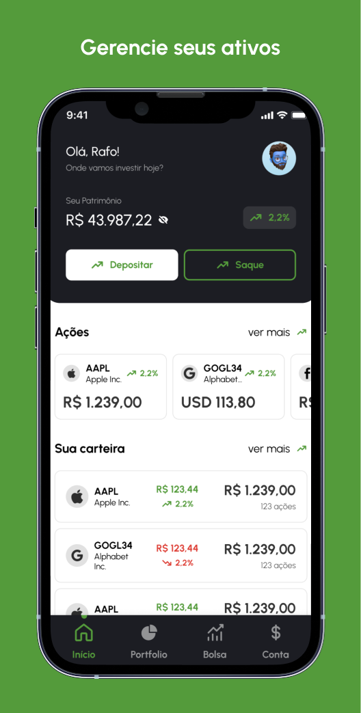
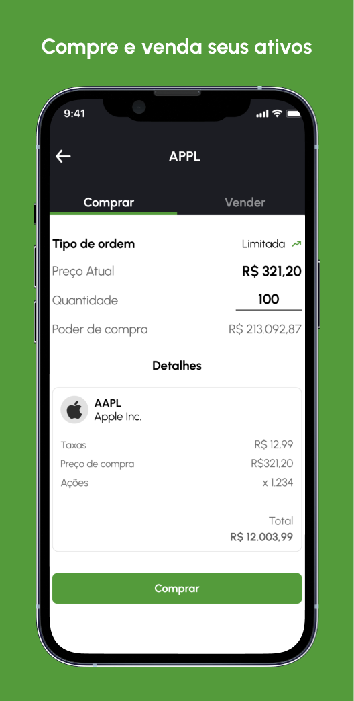
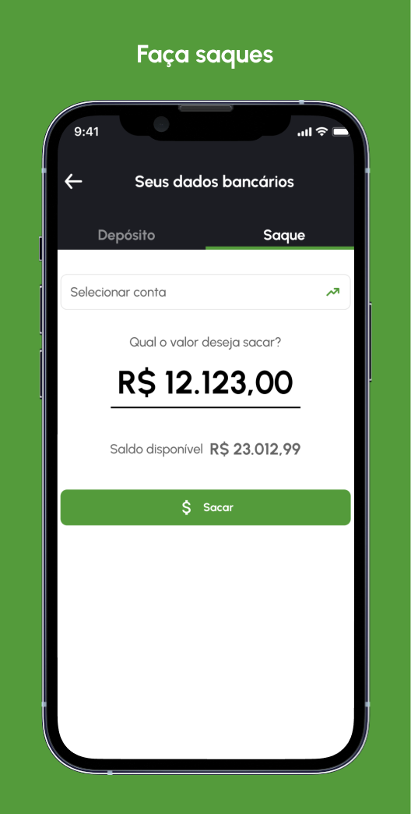

<div id="top"></div>

[![Forks][forks-shield]][forks-url]
[![Stargazers][stars-shield]][stars-url]
[![MIT License][license-shield]][license-url]
[ADD CI BADGE]

<!-- PROJECT LOGO -->
<br />
<div align="center">
  <a href="https://github.com/rafae2k/rocketbank-mobile">
    
  </a>
    </br>
    </br>

  <p align="center">
    Rocket Bank is a mobile application made with React Native. You can track your portfolio performance, make deposits and withdrawals, buy and sell stocks.
    <br />
    <br />
    <a href="http://rocketbank.com/">View Live</a>
    ·
    <a href="https://github.com/rafae2k/rocketbank-mobile/issues">Report Bug</a>
    ·
    <a href="https://github.com/rafae2k/rocketbank-mobile/issues">Request Feature</a>
  </p>
</div>

<p float="center">
  
   
  
  
</p>

<!-- TABLE OF CONTENTS -->
<details>
  <summary>Table of Contents</summary>
  <ol>
    <li>
      <a href="#about-the-project">About The Project</a>
      <ul>
        <li><a href="#built-with">Built With</a></li>
      </ul>
    </li>
    <li>
      <a href="#getting-started">Getting Started</a>
      <ul>
        <li><a href="#prerequisites">Prerequisites</a></li>
        <li><a href="#installation">Installation</a></li>
      </ul>
    </li>
    <li><a href="#usage">Usage</a></li>
    <li><a href="#roadmap">Roadmap</a></li>
    <li><a href="#contributing">Contributing</a></li>
    <li><a href="#license">License</a></li>
    <li><a href="#contact">Contact</a></li>
  </ol>
</details>

<!-- ABOUT THE PROJECT -->

## How it was made

- Used github projects to build an automated Kanban board, by creating issues/TODO's
  - requirements
  - design
  - components
  - screens
  - issues/bug's

That where being moved to the next stage soon as i opened the Pull Request, and then moved to the next stage when the Pull Request was merged into main branch.

- The standardization of the project was made with:
  - **_Commitlint_** to check the commit message following Angular's style.
  - **_lint-staged_** to ensure no lint or TypeScript errors are committed.
  - **_Prettier_** to format the code following the **_ESlint_** Standard.

<p align="right">(<a href="#top">back to top</a>)</p>

### Built With

This blog was build with JAMstack architecture, fast, reliable and SEO focused.

- 🎯 [Typescript](https://www.typescriptlang.org/)
- 📲 [React Native](https://reactnative.dev/)
- 💅 [Styled-components](https://tailwindcss.com/)
- 🧩 [Expo](https://www.expo.dev)
- ⛵️ [React Navigation](https://reactnavigation.org/)

<p align="right">(<a href="#top">back to top</a>)</p>

<!-- GETTING STARTED -->

## Getting Started

Vercel Blog Deploy

- [https://try-catch-blog.vercel.app/](https://try-catch-blog.vercel.app/)

Storybook Deploy

- [https://try-catch-storybook.vercel.app/](https://try-catch-storybook.vercel.app/)

Expo Snack - Test the app on your on web or on your phone.

[Click Here to run the app on Expo Snack](https://snack.expo.dev/@rafae2k/rafo---uber-clone)

- You can run on Web emulator of Expo Snack only on iOS or Android (Web doesn't work yet for this project) or on your device reading the QR code on Expo Go App.

### Prerequisites

This project use `yarn` as package manager, you can still use others managers as `npm`.

To enable `yarn` follow this steps.

```sh
corepack enable
```

You also need to install the `expo-cli`

```sh
yarn global add expo-cli
```

### Installation

1. Clone the repo

   ```sh
   git clone https://github.com/rafae2k/rocketbank-mobile.git
   ```

   ```

   ```

2. Install NPM packages
   ```sh
   yarn install
   ```
3. start expo
   ```sh
   expo start
   ```
4. Running on your phone

   press `c` on terminal and read the QR code with Expo GO app installed

<p align="right">(<a href="#top">back to top</a>)</p>

<!-- ROADMAP -->

## Roadmap

- [x] Create Figma prototype
- [x] Create Navigation Tabs with React Navigation
- [x] Implement screens for login, register, home, buy/sell, portfolio, market and deposit/withdraw
- [x] Add auth with Face Id and biometrics and save user data to secure storage
- [] Add animations to screens
- [] Integrate Alpaca and Coinbase APIs to get realtime data
- [] Integration with firebase auth
- [] Fix styles bug's

<p align="right">(<a href="#top">back to top</a>)</p>

<!-- LICENSE -->

## License

Distributed under the MIT License. See `LICENSE.txt` for more information.

<p align="right">(<a href="#top">back to top</a>)</p>

<!-- CONTACT -->

## Contact

- Twitter [@hm_rafo](https://twitter.com/hm_rafo)
  <br>
- Email <a href="mailto:hello@rafo.work">hello@rafo.work</a>

- Linkedin [Rafael Feitoza](https://www.linkedin.com/in/eurafo/)

<p align="right">(<a href="#top">back to top</a>)</p>

<!-- MARKDOWN LINKS & IMAGES -->
<!-- https://www.markdownguide.org/basic-syntax/#reference-style-links -->

[forks-shield]: https://img.shields.io/github/forks/rafae2k/rocketbank-mobile.svg?style=for-the-badge
[forks-url]: https://github.com/rafae2k/rocketbank-mobile/fork
[stars-shield]: https://img.shields.io/github/stars/rafae2k/rocketbank-mobile.svg?style=for-the-badge
[stars-url]: https://github.com/rafae2k/rocketbank-mobile/stargazers
[issues-shield]: https://img.shields.io/github/issues/rafae2k/rocketbank-mobile.svg?style=for-the-badge
[issues-url]: https://github.com/rafae2k/rocketbank-mobile/issues
[license-shield]: https://img.shields.io/github/license/rafae2k/rocketbank-mobile.svg?style=for-the-badge
[license-url]: https://github.com/rafae2k/rocketbank-mobile/blob/main/LICENSE.txt
[product-screenshot]: docs/assets/app-gif.gif
